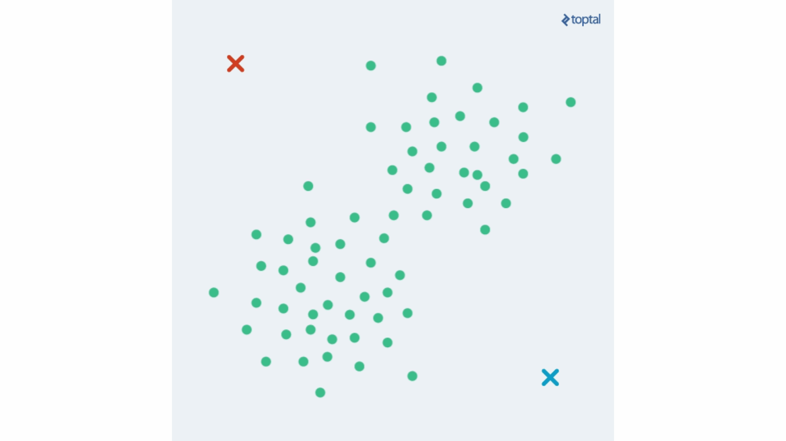
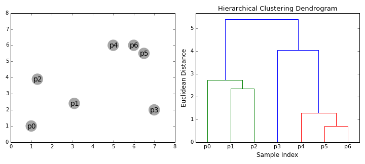
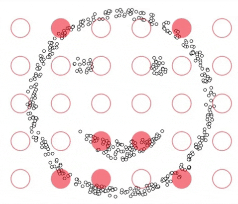

# Clustring

In this notebook, we will see three different types of clustering algorithms(K-means, agglomerative hierarchical, and DBSCAN) and see how each type of them deals with data.

**1) K-means**

it is the simpliest clustring algorithm having an iterative process in which the dataset are grouped into k number of predefined non-overlapping clusters or subgroups, making the inner points of the cluster as similar as possible while trying to keep the clusters at distinct space it allocates the data points to a cluster so that the sum of the squared distance between the clusters centroid and the data point is at a minimum, at this position the centroid of the cluster is the arithmetic mean of the data points that are in the clusters.

**2) agglomerative hierarchical**

it used to group objects in clusters based on their similarity. Next, pairs of clusters are successively merged until all clusters have been merged into one big cluster containing all objects.

**3) DBSCAN**

it is a clustering algorithm that defines clusters as continuous regions of high density and works well if all the clusters are dense enough and well separated by low-density regions. In the case of DBSCAN, instead of guessing the number of clusters, will define two hyperparameters: epsilon and minPoints to arrive at clusters.

